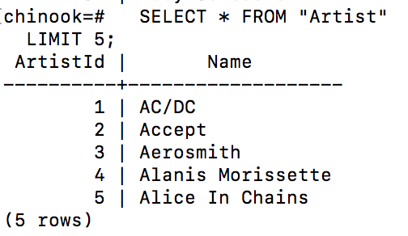

# Selecting Data Lab #

## Terminal ##

1. Reset [the coffeeshop schema](./ddl_dml_lab.md#reset-psql)
2. Initialize the full DB

       psql -h <AWS_URL> -p <PORT> -U <USER_NAME> <DB_NAME> -a -f ./labs/resources/sql/initialDb.sql 

2. Add the sample data using the following command from the root of the project

        psql -h <AWS_URL> -p <PORT> -U <USER_NAME> <DB_NAME> -a -f ./labs/resources/sql/selectData.sql
            
3. Connect to [the RDS instance and the coffeeshop db](./creating_rds_instance.md#connect-psql)
2. Now let's start with a basic select query to return *ALL* addresses `SELECT * FROM MAIN.ADDRESS;`.
    We should see a list of addresses like this...
3. That was great but WAY too much information. Now our boss wants only the first 5 addresses.
 
    2. The first way to do this is to use the `LIMIT` keyword like this
  
            SELECT * FROM "MAIN.ADDRESS"
            LIMIT 5;
  
    2. A similar way to handle this (if using a SQL:2008 v8.4) is to use the `FETCH FIRST N ROWS ONLY` keywords. 
  
            SELECT * FROM "MAIN.ADDRESS"
            FETCH FIRST 5 ROWS ONLY;
  
    2. Some DBMSs support the `TOP` keyword like in the following the following query `SELECT TOP 5 * FROM "Artist";`. However, this is not a real part of the SQL spec and doesn't work in PostGres.

    No matter which way we do this we should see the following result
        
    *It is important to notice that although these items seem to almost be in alabetical order, this is not garunteed without sorting in the query. We will talk more about this later.*

4. But wait he wants the *last* 5 artists when sorting by name. To do this let's take 2 steps, first we will provide SQL with the info it needs to sort and second we will sort descending to make sure the later letters come first.

        SELECT * 
        FROM "ADDRESS"
        ORDER BY "Name" DESC --TODO FIXME
        LIMIT 5;

    We now see that the data has been reversed and we see the items starting at the END of the alphabet. It is important to remember that order is only garunteed in SQL if you declare this `ORDER BY` keyword.

5. This is great data, however, the `ArtistId` is not providing much, so it would be nice to declare that we only need the names. In larger sets of data the ID may not be as simple as an autoincrementing integer and may leave room for confusion. To do this we remove the `*` or *wildcard* and use the actual column name

        SELECT "Name" 
        FROM "Artist"
        ORDER BY "Name" DESC
        LIMIT 5;

###### TODO ######